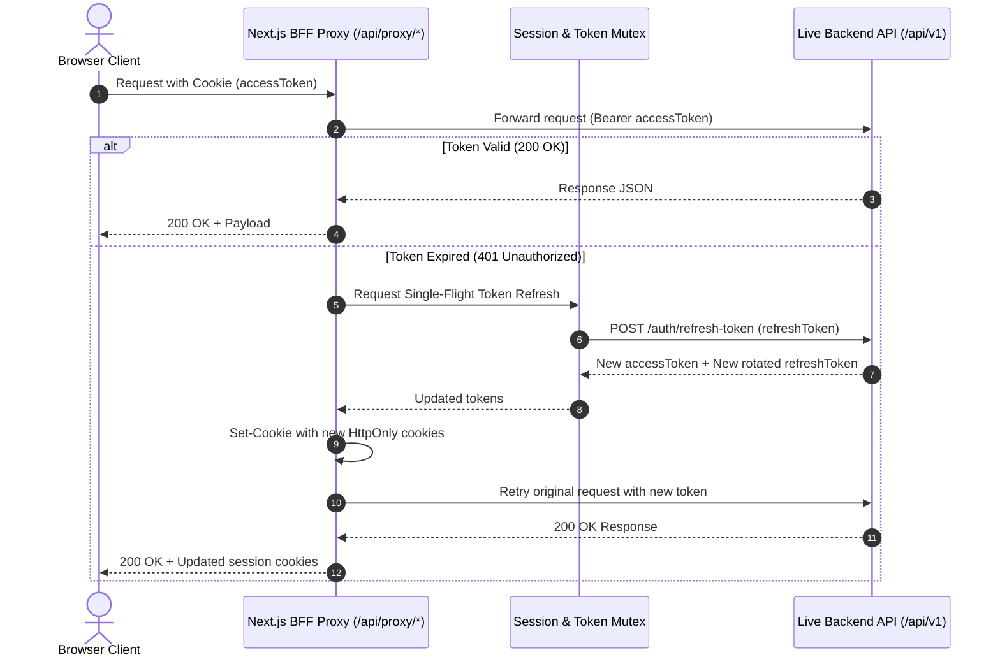

# Nestly — Housing & Roommate Management Platform

[](https://github.com/MaestroDev-H/B7A7/actions/workflows/ci.yml)
[](https://nextjs.org/)
[](https://react.dev/)
[](https://tailwindcss.com/)
[](https://www.typescriptlang.org/)

**Nestly** is an end-to-end residential housing and roommate matching web application. It connects prospective tenants with property hosts and empowers system administrators with complete ecosystem telemetry and moderation tools. Built with Next.js 16 (App Router + Turbopack), strict TypeScript, Tailwind CSS v4, shadcn/ui primitives, and TanStack Query v5.

---

## 🌐 Live Deployments & Repository Links

| Resource | URL |
|---|---|
| **Live Frontend App** | [https://nestly-frontend.vercel.app](https://nestly-frontend.vercel.app) *(or your deployed Vercel URL)* |
| **Live Backend API** | [https://b7a6-backend.vercel.app/api/v1](https://b7a6-backend.vercel.app/api/v1) |
| **Frontend GitHub Repo** | [https://github.com/MaestroDev-H/B7A7](https://github.com/MaestroDev-H/B7A7) |
| **Backend GitHub Repo** | [https://github.com/MaestroDev-H/B7A6](https://github.com/MaestroDev-H/B7A6) |
| **Postman API Docs** | Located in Backend repo: `postman/Housing-Platform.postman_collection.json` |

---

## 🔑 Demo Access Credentials

The application provides **One-Click Demo Login** buttons directly on the `/login` page for fast role evaluation:

| Role | Email | Password | Primary Capabilities |
|---|---|---|---|
| **Admin** | `admin@housing.com` | `Admin@12345` | Global telemetry, User role changes & deactivations, Property moderation, Platform-wide applications oversight, Audit logs CSV export |
| **Owner (Host)** | `owner@housing.com` | `Owner@12345` | 5-step Property & Room listing wizard, Incoming tour viewings, Tenancy lease management, Rent & Utility invoice billing, Kanban maintenance board, Financial analytics charts |
| **Tenant (Renter)**| `tenant@housing.com` | `Tenant@12345` | Roommate compatibility quiz, Room discovery filters, Tour booking, Lease applications, Stripe Checkout payments, Invoices & receipt tracking, Repair ticket reporting |

---

## 🏛️ Architecture & System Design

### 1. Server vs. Client Component Boundaries
- **Public & SEO Routes (`/`, `/about`, `/services`, `/faq`, `/contact`, `/properties`, `/rooms`)**: Built using Next.js Server Components with ISR/SSG for instant First Contentful Paint (FCP) and optimal SEO metadata.
- **Interactive Dashboards (`/dashboard/*`, `/owner/*`, `/admin/*`)**: Utilize server-side prefetching with TanStack Query `prefetchAndDehydrate()` and client-hydrated UI islands for instantaneous tab switching and optimistic state updates.

### 2. Authentication & Single-Flight Refresh Proxy Flow
All browser network traffic to the backend API is routed through the Next.js Route Proxy (`/api/proxy/[...path]`). HttpOnly session cookies protect access tokens against XSS, and a single-flight mutex prevents race conditions during refresh token rotation.



### 3. State Management & Data Flow
- **Server Cache Layer**: TanStack Query v5 with optimistic mutations, query invalidation, and custom cache keys (`src/lib/queries/keys.ts`).
- **Form State**: React Hook Form coupled with Zod schemas for client-side and server-mirrored validation.
- **Client Storage**: Zustand store with `sessionStorage` persistence for the 5-step property wizard (`src/stores/property-wizard-store.ts`).
- **URL Synchronization**: All search queries, filters, status toggles, and pagination strictly mirror URL `searchParams` for shareable links.

---

## 🧭 Complete Application Route Map

### Public Discovery & Marketing (SEO Optimized)
- `/` — Homepage with Hero, DoorPlate signature motif, Value Proposition, Featured Listings, Testimonials, FAQ Accordion, CTA.
- `/about` — Platform mission, verified hosting guarantees, architectural principles.
- `/services` — Overview of housing discovery, roommate compatibility, landlord tooling, and automated escrow billing.
- `/faq` — Expandable accordion answering common tenant and owner questions.
- `/contact` — Working contact inquiry form with toast feedback.
- `/properties` — Public property directory with search, location, property type, and rent filters.
- `/properties/[id]` — Property detail showcase with interactive image gallery, unit availability, and host contact.
- `/rooms` — Individual room unit discovery directory.
- `/rooms/[id]` — Room inspection with embedded "Request Viewing" and "Apply for Tenancy" modals.
- `/login` — Authentication with 1-click Demo credentials.
- `/register` — New account sign-up with OTP email verification redirect.
- `/verify-email` — 6-digit OTP verification page.

### Tenant Portal (`/dashboard`)
- `/dashboard` — KPI overview, upcoming unpaid invoice alert, recent applications/viewings, quick actions.
- `/dashboard/viewings` — Scheduled viewing tours with status tracking.
- `/dashboard/applications` — Rental applications with optimistic withdrawal.
- `/dashboard/roommates` — 3-tab Roommate Matching center (Preferences Form, Compatibility Matches with match scores, "Rooms for Me").
- `/dashboard/tenancies` & `/dashboard/tenancies/[id]` — Active leases, landlord contacts, invoice schedules, "End Tenancy" actions.
- `/dashboard/invoices` — Rent & deposit invoices with Stripe Checkout payment initiation.
- `/dashboard/payments` — Complete payment receipts history and transaction logs.
- `/dashboard/maintenance` — Submit repair tickets with photo attachments via client-compressed uploader.
- `/dashboard/notifications` — Notification center with unread filter and mark-all-read.
- `/dashboard/profile` — Profile updates and password reset with automatic session purge.

### Owner / Host Portal (`/owner`)
- `/owner` — Real-time property stats, "Needs Your Attention" alert center, quick listing links.
- `/owner/properties` — Listed properties directory with occupancy progress bars and publish toggles.
- `/owner/properties/new` — 5-Step Property & Room Creation Wizard (Basics, Location, Photos, Rooms Inventory, Review & Sequential Submission).
- `/owner/properties/[id]` — Property management hub with Details, Rooms Inventory (Add/Edit room unit dialogs), and Activity logs.
- `/owner/viewings` — Incoming tour requests with optimistic Approve/Reject and Complete/Cancel actions.
- `/owner/applications` — Incoming rental applications with automated lease & deposit invoice explanations.
- `/owner/tenancies` & `/owner/tenancies/[id]` — Active resident leases, Generate Rent/Utility Invoice modal (roommate split calculation), and lease termination.
- `/owner/maintenance` — 4-Column Kanban Board (Open, In Progress, Resolved, Closed) with drag/move status PATCH.
- `/owner/earnings` — Financial analytics with lazy Recharts (occupancy by property bar chart and invoice status donut chart).
- `/owner/notifications` & `/owner/profile` — Host notification feed and profile settings.

### Administrator Console (`/admin`)
- `/admin` — System metrics (Total Users, Properties, Rooms, Active Leases, Total Revenue) and lazy Recharts (user distribution donut, inventory bar, 100-log activity velocity area chart).
- `/admin/users` — Server-paginated user accounts directory with optimistic role change dialog and typed email deactivation.
- `/admin/properties` — Platform-wide listing moderation with public preview and delete actions.
- `/admin/applications` — Cross-platform application oversight and decision tools.
- `/admin/audit-logs` — Immutable audit log viewer with expandable JSON payloads and client-side CSV export.
- `/admin/settings` — Admin credentials management and system environment telemetry.

---

## 🎨 Signature Design Elements & UI Tokens

- **DoorPlate Signature Motif (`src/components/shared/DoorPlate.tsx`)**: High-contrast engraved brass unit number badge reflecting residential identity.
- **Curated Color Palette**:
  - Primary: Sage / Tea Green (`hsl(154, 45%, 38%)`)
  - Background: Crisp Surface Mist (`hsl(210, 20%, 98%)` / Dark `hsl(220, 20%, 8%)`)
  - Ink Foreground: Deep Charcoal (`hsl(220, 24%, 12%)`)
  - Accent / Signal: Signal Amber & Rose Red for status distinctions.
- **Typography Hierarchy**: *Bricolage Grotesque* (editorial display headings) and *Figtree* (legible geometric body).

---

## 🛠️ Tech Stack & Dependencies

- **Core**: [Next.js 16.4](https://nextjs.org/) (App Router, Turbopack) & [React 19](https://react.dev/)
- **Styling**: [Tailwind CSS v4](https://tailwindcss.com/) & [shadcn/ui](https://ui.shadcn.com/) (`@base-ui/react`)
- **Data & Caching**: [TanStack Query v5](https://tanstack.com/query/latest)
- **Forms & Validation**: [React Hook Form](https://react-hook-form.com/) + [Zod](https://zod.dev/)
- **State Store**: [Zustand](https://github.com/pmndrs/zustand)
- **Visualizations**: [Recharts](https://recharts.org/) (Code-split with `ssr: false`)
- **Feedback & Toasts**: [Sonner](https://sonner.emilkowal.ski/)
- **Icons**: [Lucide React](https://lucide.dev/)

---

## 💳 Stripe Sandbox Test Instructions

When paying rent or deposit invoices via `/dashboard/invoices`:
1. Click **Pay with Stripe** on any pending invoice.
2. You will be redirected to the secure Stripe Checkout portal.
3. Use the official test card credentials:
   - **Card Number**: `4242 4242 4242 4242`
   - **Expiration**: Any future date (e.g. `12/28`)
   - **CVC**: `123`
   - **Postal Code**: Any valid code (e.g. `10001`)
4. After completing payment, Stripe redirects to `/payment/success`. The client will automatically poll the backend until the invoice flips to `PAID`.

---

## ⚙️ Environment Variables Setup

Create a `.env.local` file in the project root:

```env
# Backend API Base URL
API_BASE_URL=https://b7a6-backend.vercel.app/api/v1

# Frontend Application URL
NEXT_PUBLIC_APP_URL=http://localhost:3000

# Optional Demo Credentials
DEMO_ADMIN_EMAIL=admin@housing.com
DEMO_ADMIN_PASSWORD=Admin@12345
DEMO_OWNER_EMAIL=owner@housing.com
DEMO_OWNER_PASSWORD=Owner@12345
DEMO_TENANT_EMAIL=tenant@housing.com
DEMO_TENANT_PASSWORD=Tenant@12345
```

---

## 🚀 Getting Started & Scripts

```bash
# 1. Install dependencies
pnpm install

# 2. Start development server with Turbopack
pnpm dev

# 3. Seed realistic demo data into the live backend
pnpm seed:demo

# 4. Verify TypeScript type safety (0 errors)
pnpm typecheck

# 5. Check route loading and error boundary coverage
node scripts/check-routes.mjs

# 6. Build optimized production bundle
pnpm build
```

---

## 📝 License

Distributed under the MIT License. Developed for the Nestly Housing Platform.
